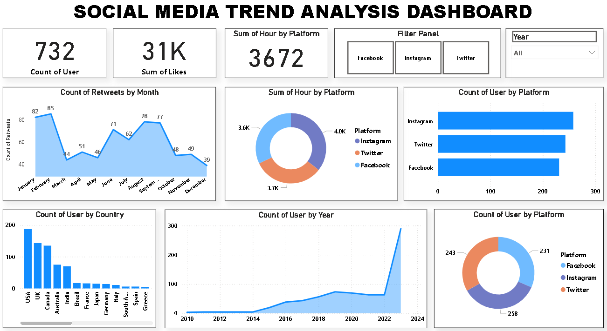

# 📊 Social Media Analysis Dashboard

This repository contains an interactive Power BI dashboard and dataset focused on analyzing social media trends, audience engagement, and platform performance. The goal is to provide actionable insights for marketing teams, social media analysts, and brand managers.

---

## 📁 Dataset Description

The dataset includes social media metrics across major platforms:

- **Platform** (Instagram, Twitter, Facebook, LinkedIn, etc.)
- **Engagement** (likes, shares, comments)
- **Post Frequency**
- **Reach & Impressions**
- **Sentiment Scores**
- **Time-Based Trends**

These data points help in understanding audience behavior, content performance, and platform effectiveness.

---

## 📈 Dashboard Features

The dashboard was created using **Microsoft Power BI** and includes:

- **📅 Trend Analysis** – Track engagement and sentiment over time.
- **📌 Platform Comparison** – Benchmark performance across platforms.
- **🚀 Top Performing Content** – Identify high-engagement posts.
- **📊 Audience Interaction Breakdown** – Analyze likes, shares, and comments by platform.
- **🎯 Dynamic Filters** – Slice data by time, platform, or metric for custom views.

---

## 🛠 Tools & Technologies

- `Power BI` – Interactive data visualization
- `DAX` – Custom calculations and dynamic KPIs
- `Excel/CSV` – "C:\Users\amytv\OneDrive\Desktop\Excel\Social Media Trend Analysis Dataset.csv"

---

## ✅ Use Cases

- Monitor and optimize social media campaign performance
- Discover content strategies that drive engagement
- Compare platform effectiveness and growth
- Support marketing decisions with data-driven insights

---

## 🔗 Live Demo

[🔍 View Live Dashboard- Power BI]
(Dashboard.png)

---

## 📷 Dashboard Preview

---
# 📫 Contact
## For questions, suggestions, feel free to reach out:

- **Name:** [AMIT VERMA]
- **Email:** [amytverma20@gmail.com.com]
- **LinkedIn:** [https://www.linkedin.com/in/amitverma20/]

> 📌 *Note: Data used may be anonymized or simulated for demonstration purposes.*

Feel free to download the `.pbix` file and explore or customize the dashboard based on your needs.
